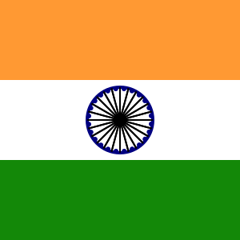

# Flags of the World

This is an ongoing personal project to code all the flags of the World using [Joy](https://github.com/fossunited/joy), a tiny creative coding library in Python.

## Sources

* Joy: a tiny creative coding library in python by [FOSS United Foundation](https://github.com/fossunited). Find out more about it here <https://github.com/fossunited/joy>.
* List of World Flags: <https://www.worldometers.info/geography/flags-of-the-world/>.
* Hex color codes for the flags: <https://www.flagcolorcodes.com/>.
* Additional info on flags(design, history, etc): <https://en.wikipedia.org/wiki/Gallery_of_sovereign_state_flags>.
* SVG Path Editor: There were some complex shapes(emblems, coat of arms, etc) which could not be rendered using the set of shapes available in Joy. Hence used an online tool to create and manipulate SVG paths <https://yqnn.github.io/svg-path-editor/>.

## Status

This is an ongoing project. There are a few flags which have been partially completed. So, for easy reference, I have used the following status field:

* Completed - which means done obviously (lol).
* WIP - Work In Progress.

# Example



```
#Country: Republic of India
#Description: Representing Indian Flag.
#version: 1.0.0
#Status: Completed

#Co-ordinates for the lines.
x1,y1 = 0,41
x2,y2 = 0,-41

#Individual components of the Indian flag.
saffron_rectangle = rectangle(y=100,w=300, h=100, fill="#FF9933",stroke="none")
white_rectangle = rectangle(w=300, h=100, fill="#FFFFFF",stroke="none")
green_rectangle = rectangle(y=-100,w=300, h=100, fill="#138808",stroke="none")
outer_circle = circle(r=41, stroke="#000080", stroke_width=4)
inner_circle = circle(r=7, fill="#000080", stroke="none")
spokes = line(x1,y1,x2,y2, fill="#000080", stroke_width=2) | repeat(24, rotate(15))
semi_circles = circle(x=5,y=39,r=3,fill="#000080",stroke="none") | repeat(24, rotate(15))

#combine all the various shapes and assign them to a single variable.
indian_flag = saffron_rectangle + white_rectangle + green_rectangle + outer_circle + inner_circle + spokes + semi_circles

#display the indian flag.
show(indian_flag)
```

Check out the rest of them [here](https://samboyyspirit.github.io/flags_of_the_world/world_flags.html)

# Acknowledgement

This project was inspired after I took up the creative coding course [The Joy of Programming](https://mon.school/courses/the-joy-of-programming) by [mon.school](https://mon.school/).

Special thanks to the Instructor [Anand Chitipothu](https://github.com/anandology) and [FOSS United Foundation](https://github.com/fossunited).
***